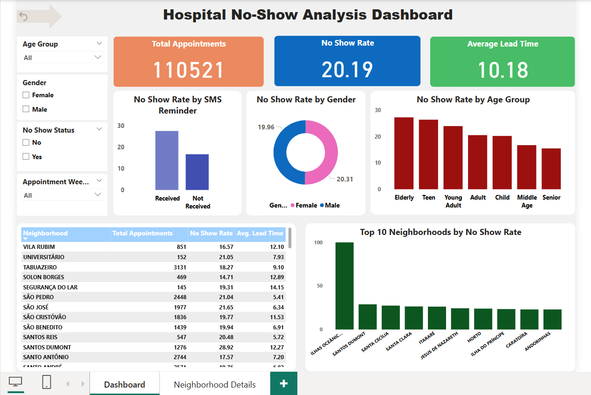
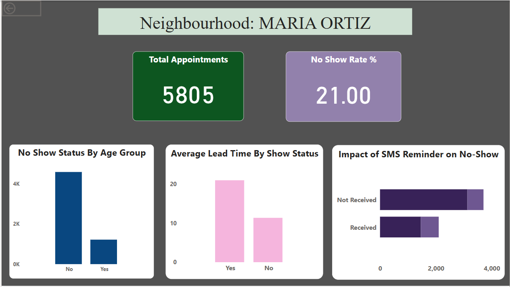

# 🏥 Hospital No-Show Analysis Project

This project aims to analyze patterns behind missed medical appointments using real-world data. It combines **Python**, **MySQL**, and **Power BI** to demonstrate a full data analytics pipeline — from cleaning to visualization.

## 📌 Objective

To identify key factors that contribute to patient no-shows in hospital appointments and present those insights through interactive dashboards.

---

## 🛠️ Tools Used

| Tool        | Purpose                                 |
|-------------|------------------------------------------|
| **Python**  | Data cleaning, preprocessing, EDA        |
| **Pandas**  | Data wrangling and transformations       |
| **MySQL**   | Data storage and SQL-based analysis      |
| **Power BI**| Visualization and dashboard reporting    |

---

## 🧑‍💻 Project Workflow

### 1. 🔹 **Python (Jupyter Notebook)**
- Loaded and cleaned the dataset using `pandas`
- Created new columns: `lead_time`, `appointment_month`, `appointment_weekday`, `age_group`, etc.
- Exported the cleaned dataset to CSV

### 2. 🔹 **MySQL**
- Imported the cleaned dataset into MySQL
- Performed basic to intermediate SQL analysis:

> Note: We used a flat table without normalization for simplicity.

### 3. 🔹 **Power BI**
- Connected to the MySQL database
- Created interactive dashboard featuring:
  - **KPIs**: Total Appointments, Average Lead Time, No-show Rate
  - **Bar Charts**: No-show by Age, Gender, Neighbourhood, SMS Reminder
  - **Slicers**: Filter by Age Group, Gender, SMS Received, Neighbourhood
  - **Drillthrough** page for neighbourhood-wise appointment insights
  - **Dynamic Titles**, **Custom Tooltips**, and **Formatted Cards**
---

### 📊 Power BI Dashboard

The final dashboard (`hospital no show dashboard.pbix`) is included in the `powerbi/` folder.

### 🔎 Drill-Through Feature

This dashboard includes a drill-through functionality:

- Clicking on a **neighbourhood** in the main bar chart allows users to navigate to a **detailed view page**.
- The drill-through page displays metrics specific to that neighbourhood, like:
  - Total appointments
  - No-show rate
  - Age and gender breakdown

#### 📷 Screenshots

**Main Dashboard (click to drill through):**



**Drill-Through Page:**




## 📊 Key Insights
- Patients receiving SMS reminders showed reduced no-show rates.
- Young adults (age 0–20) were more likely to miss appointments.
- Certain neighbourhoods had a significantly higher no-show rate.

---

## 📁 Folder Structure

```
Hospital-NoShow-Analysis/
│
├── data/
│   └── cleaned_appointments.csv
│
├── notebooks/
│   └── data_cleaning_and_eda.ipynb
│
├── sql/
│   └── analysis_queries.sql
│
├── powerbi/
│   └── Hospital_NoShow_Dashboard.pbix
│
├── README.md
```

---

## 🚀 How to Run
1. Clone the repo
2. Run the Jupyter notebook from `notebooks/`
3. Load the CSV into MySQL (optional)
4. Open `.pbix` file in Power BI Desktop

---

## 📫 Contact

For questions or collaboration, feel free to reach out via GitHub.

---
